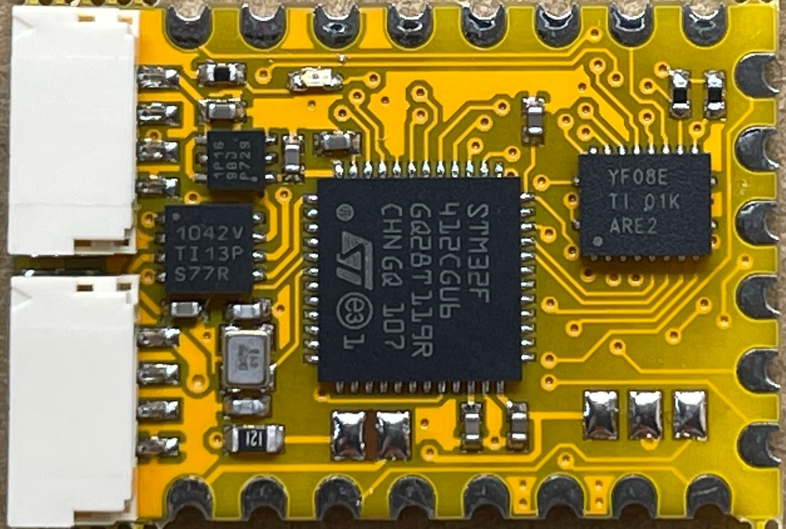
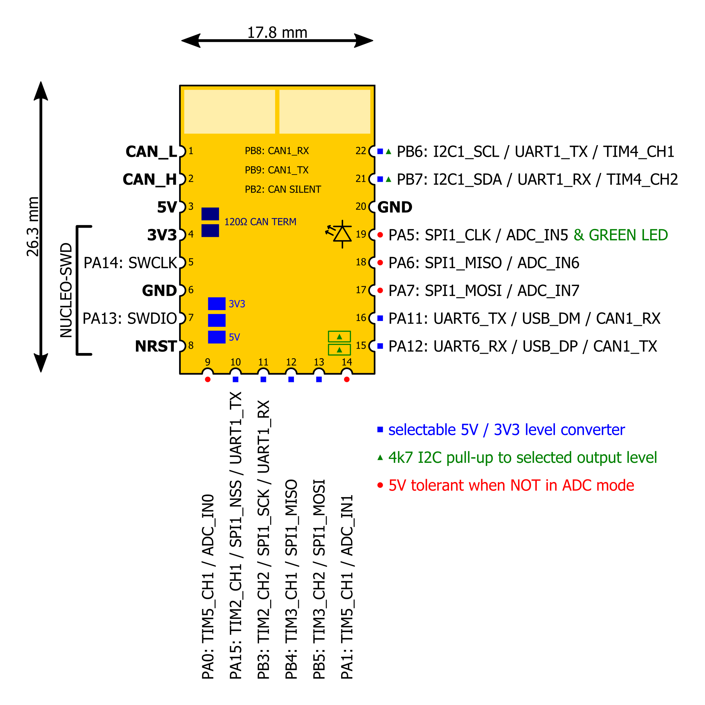

# Bird-CANdy

[![CC BY 4.0][cc-by-shield]][cc-by-sa] 

PCB designed mainly as a universal [UAVCAN](https://uavcan.org/) sensor node which may also be used as a generic CAN interfacing device.

 

# What's UAVCAN Node? #
UAVCAN Node is a device that speaks UAVCAN protocol which is usually used to exchange data between autopilot (e.g. The Cube or Pixhawk running Ardupilot software)
and peripherals like GPS, Compass, LEDs, etc.

# Advantages of Bird CANdy PCB #
PCB was designed with hobbyist, DIYers and researchers in mind.
* Fully Open Source Hardware for non-commercial use
* Only 2 copper layers for cheap production
* 3.3V or 5V selectable outputs
* JST-GH connectors (fully compatible with [The Cube Autopilot](https://github.com/proficnc/The-Cube))
* Supports all [Ardupilot](https://ardupilot.org/) peripherals like GPS, Compass, Baro, IMU, LEDs, etc, as well as PWM Servo output.

# What about the software? #
PCB can run [AP_Periph](https://github.com/ArduPilot/ardupilot/tree/master/Tools/AP_Periph) or your own software written for STM32 microcontroller.

# Pinout #

# Commercial license #
If You need a commercial license please send us an email to contact@flyfocus.pl 
<!-- 
 -->

[cc-by-sa]: https://creativecommons.org/licenses/by-sa/4.0/
[cc-by-shield]: https://img.shields.io/badge/License-CC%20BY%20%20SA%204.0-a8400e